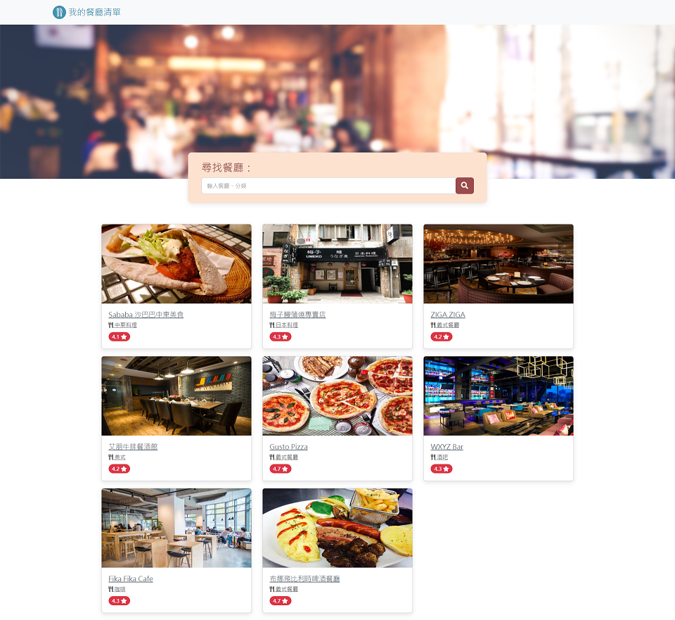

# Restaurant list 餐廳清單
這是一份可以顯示餐廳清單的網站，使用者可以在此點選餐廳項目展示該餐的詳細資訊，並可以使用搜尋列透過關鍵次搜尋符合的餐廳列表

## Website home page preview 網站首頁預覽


## Features 網站功能
 * 網站首頁會展示所有的餐廳列表，其列表項目包含：
   * 餐廳照片
   * 餐廳名稱
   * 餐廳分類
   * 餐廳評分
 * 只用者點選列表其中一個項目會展示該餐廳的詳細資訊：
   * 類別
   * 地址
   * 電話
   * 描述
   * 圖片
 * 使用者可以透過搜尋列輸入關鍵字搜尋符合條件的餐廳，例如
   * 餐廳種類
   * 餐廳名稱

 ## Environment Requirement 環境需求
 * 必須已經安裝 Nodejs 執行環境
 * git 套件

 ## Execution 執行方式
**Winsows 執行環境注意事項**
    其專案所在路徑不可以有空白字元 ex: `C:\alpha camp\my folder` 跟是有非英文非 ASCII 字元 ex: `C:\Users\吳柏毅\dev`

## 步驟 Step
1. 先用 git clone 從 github repositories 複製檔案，使用 ssh 協定。
```sh
git clone git@github.com:weijieChi/RestaurantsListWebSite.git
```
2. 進入專案所在目錄
```sh
cd ./RestaurantsListWebSite
```
3. 使用 npm 安裝執行所需的套件。
```sh
npm install
```
4. 透過 npm 執行伺服器程式。
```sh
npm run dev
```
5. 在瀏覽器網址列輸入 `http://localhost:3000/` 就可以打開網頁了
6. 最後要關閉伺服器就在 terminal 案 `ctrl` + `C` 再按 `y` + `enter` 關閉 nodejs 伺服器。